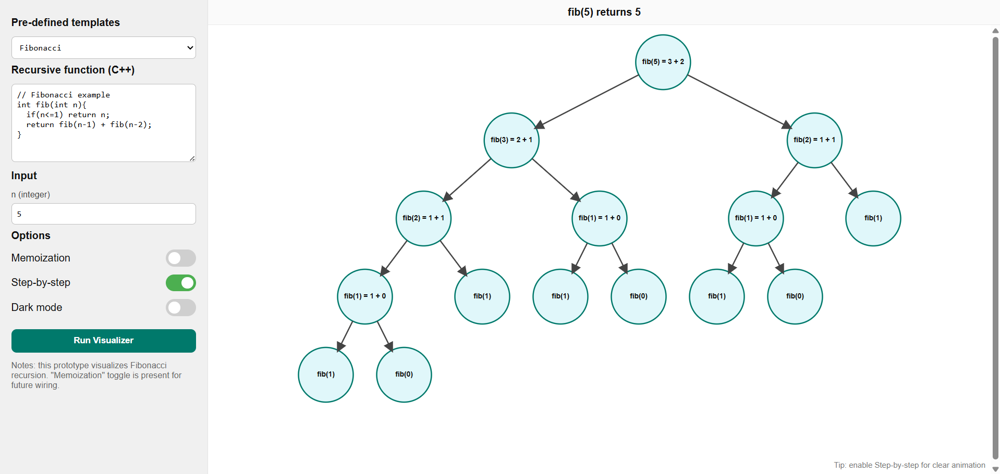
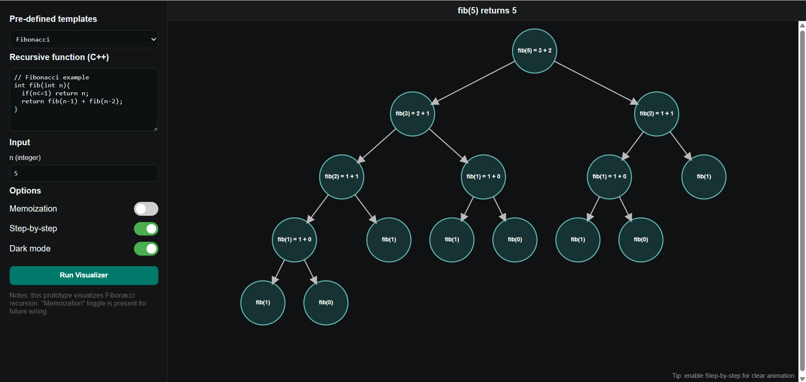
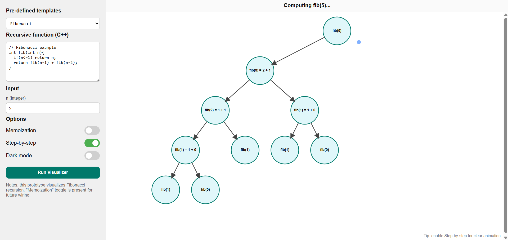

# Recursion Tree Visualizer

Interactive recursion tree visualizer built using HTML, CSS, JavaScript, and SVG animations.

## Features
- Fibonacci recursion visualization
- Animated traversal arrows
- Step-by-step execution
- Dark mode support
- SVG-based tree rendering
- Recursive call tracing

## Tech Stack
- HTML
- CSS
- JavaScript
- SVG

## Limitations
- Visualization is optimized for smaller inputs (recommended n ≤ 5)
- Larger recursion trees may overlap or reduce animation clarity

## Future Improvements
- Factorial visualization
- N-Queens visualization
- Memoization support
- Speed controls
- Dynamic tree scaling for larger recursion depths
- Zoom and pan support

## How to Run
1. Clone the repository
2. Open `index.html` in your browser

## Screenshots

### Light Mode

### Dark Mode

### Traversal Animation

